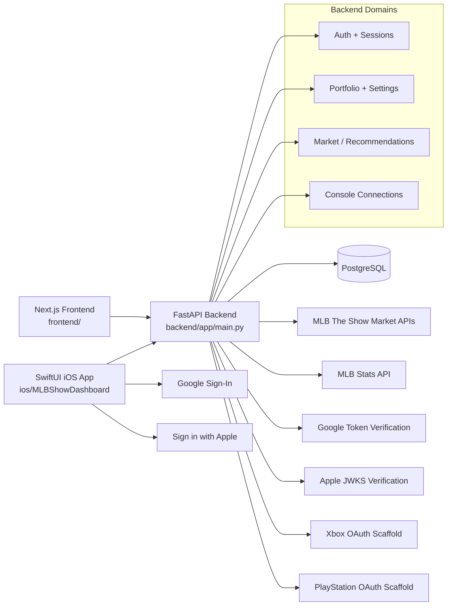

# Architecture Diagram

This diagram shows how the backend, frontend, iOS app, database, and external providers fit together.

## Notes
- The web frontend and iOS app both use the same FastAPI backend.
- PostgreSQL stores user accounts, refresh tokens, user settings, portfolio data, connection state, and analytics records.
- Google and Apple auth are verified server-side.
- Xbox and PlayStation integrations are structured for future real OAuth support while keeping mock mode usable today.
